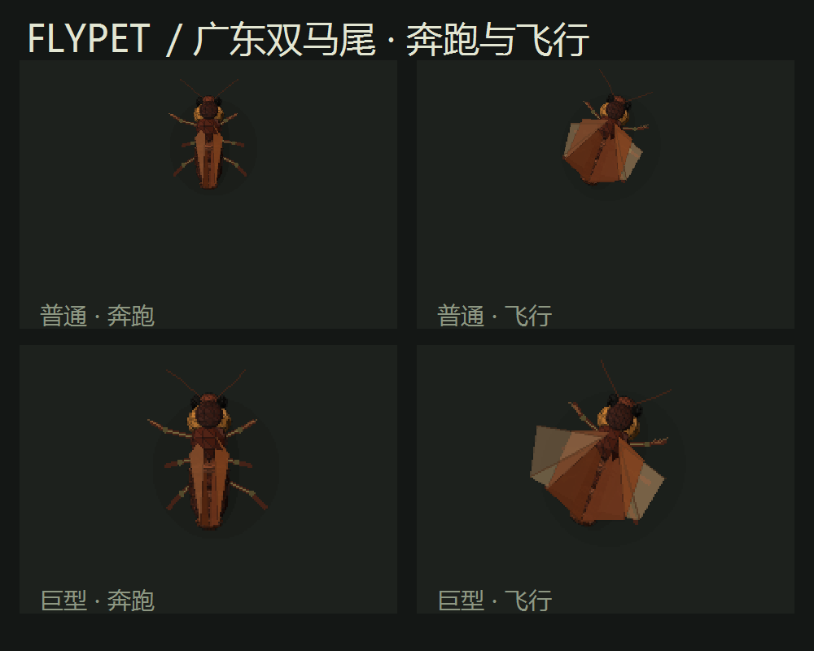

# FlyPet · 果蝇 / 广东双马尾桌宠

Windows 10/11 x64 桌宠。可在果蝇与“广东双马尾”（美洲大蠊外观）之间切换。使用 .NET 8 SDK 运行 `./build.ps1` 后，双击 `dist/FlyPet.exe` 即可使用；生成的便携 EXE 自带 .NET 运行时，正常运行无需 Python、联网或 GPU。



托盘的“切换外观”、小窝和设置窗口都可换皮肤。果蝇默认 90 px，普通广东双马尾默认 120 px；每次出生有 1/10 概率成为放大版，默认 500 px，概率与两种尺寸都可调。蟑螂低速时奔跑，冲刺时抬起外壳并拍动内翅，减速后落地；偶尔会说“Ciallo～(∠・ω< )⌒★”。神经、糖和逃逸规则沿用果蝇逻辑。


程序启动后直接放出桌宠。需要控制中心时，在右下角托盘图标右键选择“打开小窝”；设置窗口也从托盘进入。托盘顶层保留投糖、换外观、暂停和退出；状态条、无敌、立即复活、大脑图等收在“更多操作”。没有左下角控制栏，也没有苍蝇拍切换模式。桌宠一直把靠近的鼠标当作威胁并躲避；普通桌面点击穿透，直接点到桌宠时才会击中它。逃逸采用距离闭环：距离误差、持续时间和距离变化率共同形成逃逸紧迫度；无法拉开距离会继续加速并触发短促急转，稳定超过安全半径后才解除。托盘图标悬停文字显示生命与饱腹百分比。

死亡后默认随机等待 45–90 秒复活，等待时间可在“生存”栏目调整；托盘的“立即复活”可跳过等待。果蝇被拍死留下泥状残骸，饿死则翻身；广东双马尾留下小白卵。默认饱腹下降与活动消耗已放慢，饱腹归零后从满血到饿死约需 20 分钟。无敌模式下拍打仍会让它短暂警觉、加速逃跑，但不扣血。糖需要持续接触并由进食回路保持激活一段时间才会吃完。屏幕边缘进入视觉运动回路；真实撞到边界时会物理反弹、不掉血，并产生负面奖励。绘制目标 90 FPS，可在 20–120 FPS 间调整。

两套外观都由程序内的低多边形 3D 几何绘制，采用固定俯视视角、深度排序、动态翅膀和接触阴影。没有使用 Buckshot Roulette 的原始资源。果蝇默认 90 像素，蟑螂默认 120 像素，基础速度为 400 像素/秒；设置中可以继续调高。

桌宠死亡后，鼠标悬停在残骸或小白卵上会出现复活与清理选项。果蝇模式的白眼个体与蟑螂模式的巨型个体分别默认以 1/10 概率出现；稀有个体沿用原有较高生命与速度倍率，出现时托盘会提示。

## 大脑与真实性

内置回路从本机 MaleCNS v1.0 数据导出，共 16,711 个神经元、2,075,126 条非零有符号连接，约为完整神经元数量的十分之一。[MaleCNS 数据下载页](https://male-cns.janelia.org/download/)提供神经元注释与连接权重；本程序内嵌提取结果，不需要运行时访问原始大文件。除了原有 LC4/LPLC2 视觉、DNp01 逃逸、飞行/转向/翅肌、甜味 GRN 和 MN9 回路，现在还包含视觉运动、嗅觉、蘑菇体 Kenyon Cell/MBON、DAN/PAM/PPL 奖励、中央复合体导航、下行与运动神经元以及它们的强连接伙伴。

糖会产生随距离衰减的嗅觉场，方向性嗅觉活动参与转向。每块糖只能触发一次进食；进食产生正奖励，撞击边缘产生负奖励。位置由一组真实蘑菇体神经元做稀疏编码，奖励调制其可塑记忆值，因此重复在相近位置投糖会提高该区域的回忆优先级。每次撞击默认强化约 300 像素直径内的位置负价值；多个撞击区域共同形成局部排斥方向，再经视觉运动、导航和下行转向输出改变飞行方向。记忆只属于当前这只果蝇；死亡复活、立即复活或重新启动程序都会从空白记忆开始。

每个神经元在 1 ms 时间步按带突触电流、膜电位、阈值、不应期和传输延迟的简化 LIF 方程更新；放电沿内置真实拓扑传播。视觉/甜味感觉群接受人工编码的外部电流，运动群不接受直接写入的行为命令。输出群的放电率参与飞行、转向、逃逸和进食的身体解码。翅肌群对实际飞行读出更有用；MN9 在这个缩减回路的默认条件下不稳定放电，因此进食量由甜味 GRN 活动调制。

**这不是 Google 提供的“完整果蝇大脑模型”，也不是已经验证的生物电生理重建。** 数据文件托管地址含 Google Cloud Storage，并不表示 Google 训练或验证了桌宠的大脑。感觉编码、饥饿与休息、受伤兴奋、身体动力学、血量、随机复活和屏幕碰撞仍是明确编写的程序规则；连接符号来自原 `FlyBrain` 缓存的递质假设，突触强度经过截断与归一化。不能宣称所有行为都从连接组自行涌现。

“大脑活动图”显示原始注释给出的胞体 XY/XZ 投影：每个点是一个 bodyId，亮度来自本程序实时计算的放电率。点击点可看类型、侧别、递质、坐标、膜电位、放电率及最强输入/输出；下面保留最近 60 秒的群组活动热图。可以在图中开关突触传播、边缘感觉输入和神经转向读出，观察行为差异。切断突触后，感觉群仍可能放电，但正常的运动群输出和飞行会消失。“神经连接证据”另提供同随机种子、同刺激下的消融对照。这些操作证明软件的计算依赖已加载的边，不能证明它和真实苍蝇的功能完全一致。

## 自己核对数据，而不是相信测试报告

`tools/verify_source.py` 独立于提取器和模拟器。它先把本机原始胞体注释文件算出 SHA-256，与 `FlyBrain/flybrain/data/manifest.json` 中官方下载文件记录比较；再核对全部 16,711 个 bodyId、类型、侧别、胞体坐标和全部 2,075,126 条有符号连接，与本机 `FlyBrain/cache` 中的编译矩阵逐一比较。加 `--hash-weights` 还会计算约 1.1 GB 原始连接权重文件 SHA-256，便于和[官方来源](https://male-cns.janelia.org/download/)比对。

独立来源核对需要把本项目放在已下载 MaleCNS/FlyBrain 原始缓存的工作区旁，再运行：

```powershell
python .\tools\verify_source.py --hash-weights
```

也可直接打开 `FlyPet/Assets/circuit.json` 查任一节点 `bodyId` 和任一边 `[突触前索引, 突触后索引, 有符号计数]`，在活动图点同一节点看实时电压/放电率；阅读 `Brain.cs` 的 `SetInput`、`Step` 及 `Simulation.cs` 的 `Update` 可看到刺激如何变成神经活动再到动作。哈希、原始文件及独立脚本比本程序自己生成的测试 JSON 更容易复核，但仍不能验证生物学行为预测；那需要真实神经记录与损毁实验。

## 设置与开发

设置文件在 `%LOCALAPPDATA%\FlyPet\settings.json`，可在设置窗口修改并从托盘重新加载。设置窗口可调大小，顶部按“外观 / 生存 / 行为 / 神经 / 系统”分类，当前栏目会高亮。外观包括两种皮肤、尺寸和稀有概率；生存包括饱腹消耗、饥饿失血与复活时间。尺寸范围为 60–800 px。“恢复默认”会保存并应用默认值。高级使用者可把符合 `Assets/circuit.json` 格式的自定义回路放到设置目录作为覆盖文件；移走后恢复内置回路。

现有实例可以接收本地命名管道命令，例如 `dist/FlyPet.exe --command brain-map`、`--command revive`、`--command skin cockroach`、`--command skin fly`、`--command invincible on`、`--command status --output <路径>`。完整命令还包括 `show`、`hide`、`menu`、`settings`、`evidence`、`audit`、`pause`、`resume`、`normal`、`sugar-mode`、`drop x y`、`swat x y`、`recall`、`clear`、`reload`、`exit`。`swatter` 仅作为旧脚本兼容别名，不会显示苍蝇拍模式；`swat x y` 仍可用于自动化测试点击。`status.json` 定期写到设置目录。

重新编译：安装 .NET 8 SDK，在 `FlyPet/` 运行 `./build.ps1`，会生成独立便携的 `dist/FlyPet.exe`。若需重新从原始缓存提取回路，先运行 `..\FlyBrain\.venv\Scripts\python.exe tools\extract_circuit.py`。`dotnet bin/Release/net8.0-windows/FlyPet.dll --self-test test-results` 可做逻辑、学习、碰撞、外观和纯计算性能检查。当前本机 Release 自测覆盖神经飞行、逃逸转向、渐进进食、饱腹回血、边缘负面记忆和新个体记忆清空；纯模拟与几何绘制性能也纳入检查。这是计算基准，不等同于 Windows 桌面实际 FPS。运行时 `status.json` 提供实测 FPS、嗅觉、奖励、记忆置信和碰撞次数。每次只在选定显示器工作区域内生活；安全桌面、锁屏与独占全屏不保证置顶。错误日志在 `%LOCALAPPDATA%\FlyPet\error.log`。
